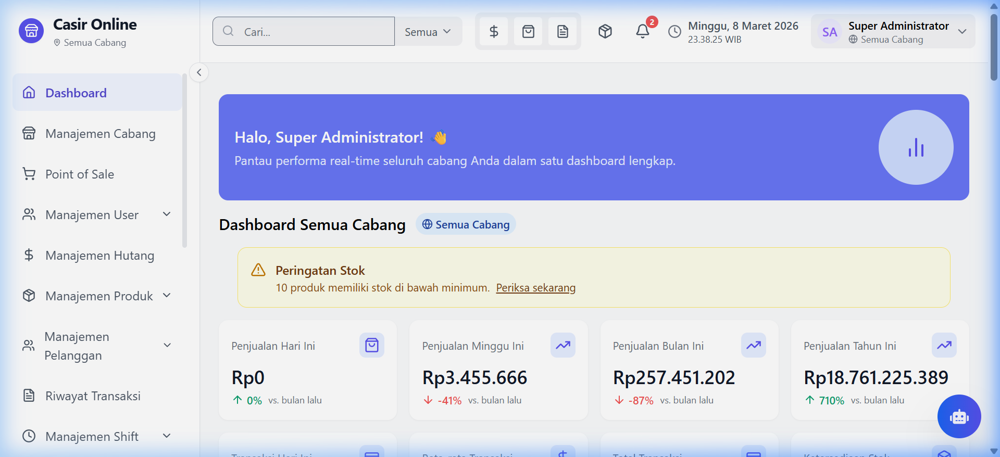
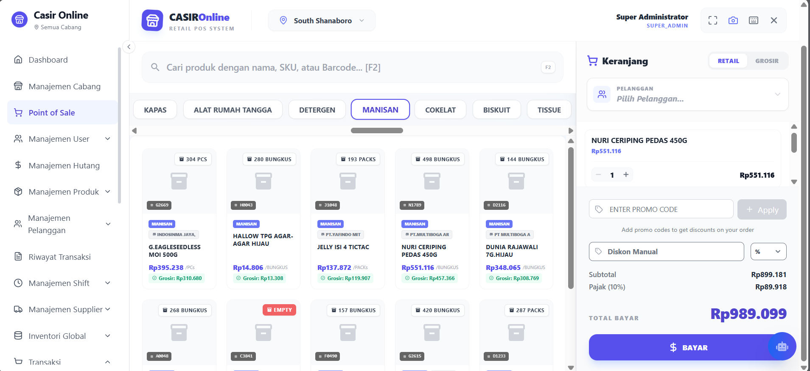
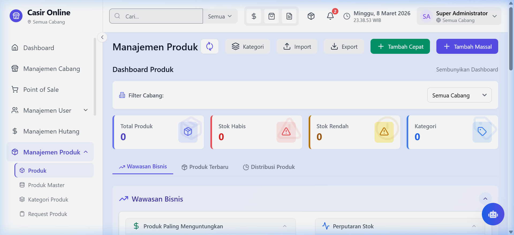
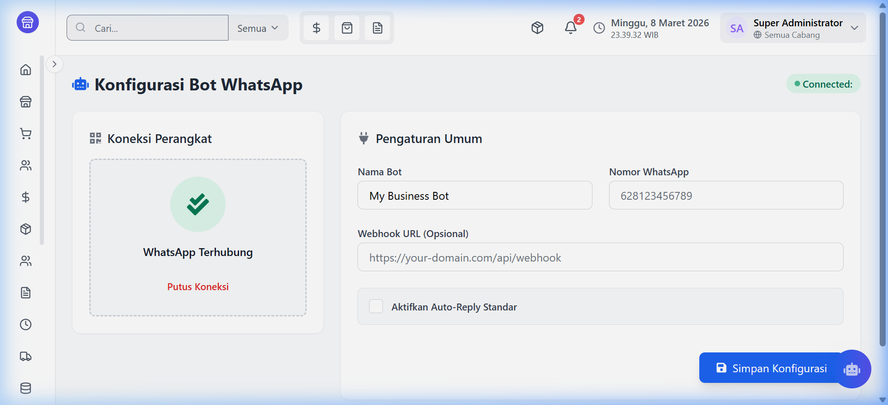
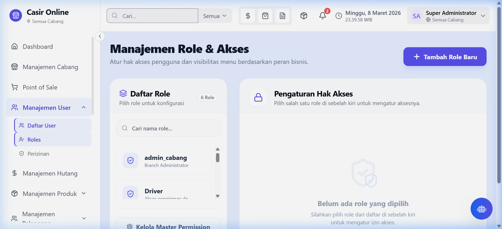
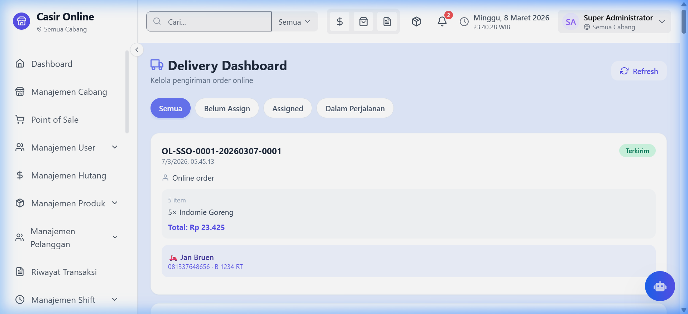
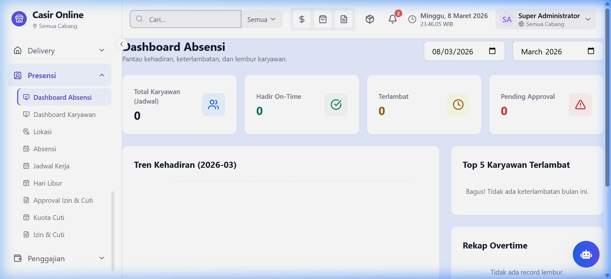
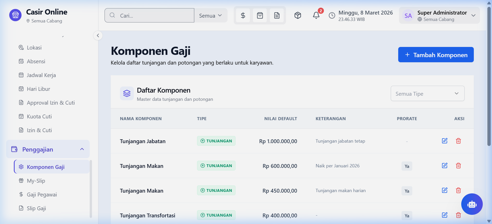

# Sistem Point of Sale (POS)

Sistem Point of Sale (POS) modern yang didesain untuk manajemen retail multi-cabang dengan dukungan penuh untuk inventory management, transaksi penjualan/pembelian, dan customer relationship management.

## Antarmuka Aplikasi

Berikut adalah beberapa tampilan dari modul-modul utama di Casir Online:

<details>
  <summary><b>Lihat Screenshot Laporan & Analitik</b></summary>
  <br/>
  
</details>

<details>
  <summary><b>Lihat Screenshot Kasir Pintar (POS)</b></summary>
  <br/>
  
</details>

<details>
  <summary><b>Lihat Screenshot Manajemen Stok</b></summary>
  <br/>
  
</details>

<details>
  <summary><b>Lihat Screenshot WhatsApp Bot</b></summary>
  <br/>
  
</details>

<details>
  <summary><b>Lihat Screenshot Akses & Role</b></summary>
  <br/>
  
</details>

<details>
  <summary><b>Lihat Screenshot Kurir Delivery</b></summary>
  <br/>
  
</details>

<details>
  <summary><b>Lihat Screenshot Absensi Karyawan</b></summary>
  <br/>
  
</details>

<details>
  <summary><b>Lihat Screenshot Sistem Payroll</b></summary>
  <br/>
  
</details>

## Fitur Utama

### Manajemen Pengguna & Cabang
* ✅ Autentikasi pengguna dengan multi-role & multi-cabang
* ✅ Dashboard khusus per cabang

### Manajemen Produk & Inventory
* ✅ CRUD Produk Master & Produk per Cabang
*  Stock tracking & transfer antar cabang
*  History perubahan harga & multiple pricing

### Transaksi
*  ✅ Transaksi penjualan dengan UI POS yang responsif
*  Retur penjualan & pembelian
*  Dukungan berbagai metode pembayaran (tunai, kartu, QRIS, e-wallet)

### CRM & Supplier
*  Manajemen pelanggan 
*  Program loyalti & point rewards
*  Manajemen supplier 

### Promo & Diskon
*  Fitur promo yang 
*  Support untuk berbagai jenis diskon (persentase, nominal,, bundle)

### Shift & Keuangan
*  Manajemen shift dengan kas awal & akhir

### Reporting
* Laporan penjualan, pembelian, stok
* Laporan keuangan & customer
* Export ke PDF, Excel

## Teknologi

### Frontend
* React.js
* Tailwind CSS
* Redux untuk state management
* Responsive design untuk desktop & mobile

### Backend
* Node.js & Express.js
* Prisma ORM
* PostgreSQL Database
* JWT Authentication

## Struktur Database

Database menggunakan PostgreSQL dengan Prisma sebagai ORM. Struktur utama database meliputi:
* **Cabang**: Manajemen informasi cabang dengan fitur geofencing
* **User & Role**: Manajemen pengguna dengan role-based access control
* **Produk**: Master produk dan stok per cabang
* **Transaksi**: Penjualan, pembelian, dan retur
* **Pelanggan & Supplier**: Data pelanggan dan supplier
* **Inventory**: Pergerakan stok, transfer, dan tracking batch

## Instalasi

### Prasyarat
* Node.js v14+
* PostgreSQL 12+
* npm atau yarn

### Langkah Instalasi
1. Clone repository

```bash
git clone https://github.com/roihan12/Casir-Online.git
cd casir-online
```

2. Install dependensi

```bash
# Install backend dependencies
cd backend
npm install

# Install frontend dependencies
cd ../frontend
npm install
```

3. Setup database

```bash
# Di direktori backend
cp .env.example .env
# Edit file .env dan sesuaikan DATABASE_URL

# Jalankan migrasi
npx prisma migrate dev
```

4. Jalankan aplikasi

```bash
# Di direktori backend
npm run dev

# Di direktori frontend (terminal baru)
npm start
```

## Status Pengembangan

### Backend

#### Fitur yang Sudah Dikerjakan ✅
- ✅ Autentikasi pengguna dengan multi-role
- ✅ Manajemen pengguna multi-cabang
- ✅ Operasi CRUD dasar untuk produk master
- ✅ Manajemen produk spesifik per cabang
- ✅ Manajemen shift dengan kas awal dan akhir
- ✅ Manajemen pelanggan
- ✅ Pelacakan riwayat harga
- ✅ Pemrosesan transaksi penjualan dasar
- ✅ Integrasi WhatsApp Bot untuk pesanan
- ✅ Manajemen Delivery/Kurir
- ✅ Modul Absensi Karyawan
- ✅ Modul Sistem Payroll (Penggajian)

<!-- #### Fitur dalam Pengerjaan 🔄
- 🔄 Implementasi program loyalitas dan point rewards lanjutan
- 🔄 Sistem manajemen promo yang lebih komprehensif
- 🔄 Jenis diskon komprehensif (BOGO, bundle)
- 🔄 Pelaporan keuangan lanjutan -->

#### Fitur yang Belum Dikerjakan ⏳
- ⏳ Optimasi API untuk skenario traffic tinggi
- ⏳ Peringatan inventaris otomatis
- ⏳ API batch untuk operasi massal
- ⏳ Fitur keamanan yang ditingkatkan
- ⏳ Sistem notifikasi real-time
- ⏳ Pelacakan stok lanjutan
- ⏳ Transfer stok antar cabang
- ⏳ Dukungan multiple pricing
- ⏳ Transaksi pembelian dengan alur persetujuan
- ⏳ Retur penjualan dan pembelian
- ⏳ Dukungan metode pembayaran beragam (tunai, QRIS, e-wallet)
- ⏳ Manajemen supplier
- ⏳ Laporan dasar untuk penjualan, pembelian, dan inventaris

### Frontend

#### Fitur yang Sudah Dikerjakan ✅
- ✅ Antarmuka login dan manajemen pengguna
- ✅ Dashboard cabang dengan analitik
- ✅ Layar manajemen produk & katalog
- ✅ Antarmuka pelacakan inventaris
- ✅ Antarmuka transaksi POS (Kasir Pintar)
- ✅ Layar manajemen pelanggan (CRM)
- ✅ Antarmuka manajemen supplier
- ✅ Antarmuka Role & Hak Akses
- ✅ Dashboard Kurir Delivery
- ✅ Modul Absensi Staf & Karyawan
- ✅ Modul Sistem Payroll
- ✅ Tampilan laporan sederhana
- ✅ Desain responsif, modern, tanpa gradient untuk desktop

#### Fitur dalam Pengerjaan 🔄
- 🔄 UI POS lanjutan dengan shortcut keyboard
- 🔄 Visualisasi data interaktif untuk laporan
- 🔄 Kemampuan filter dan pencarian lanjutan

#### Fitur yang Belum Dikerjakan ⏳
- ⏳ Optimasi responsif penuh untuk layar mobile kecil
- ⏳ Kemampuan mode offline (PWA)
- ⏳ Portal loyalitas yang menghadap ke pelanggan
- ⏳ Manajemen inventaris drag-and-drop
- ⏳ Antarmuka kustomisasi pembuat struk
- ⏳ Dukungan tema gelap (Dark Mode)
- ⏳ Optimasi performa UI tahap lanjut
- ⏳ Pengalaman onboarding pengguna yang ditingkatkan
- ⏳ Peningkatan aksesibilitas web
- ⏳ Pengujian kompatibilitas lintas browser
- ⏳ Widget dashboard interaktif drag-and-drop
- ⏳ Fungsionalitas ekspor untuk semua dokumen laporan


## Kontribusi

1. Fork repository
2. Buat branch fitur (`git checkout -b feature/amazing-feature`)
3. Commit perubahan Anda (`git commit -m 'Add some amazing feature'`)
4. Push ke branch (`git push origin feature/amazing-feature`)
5. Buka Pull Request


## Lisensi

Proprietary software. All rights reserved.
